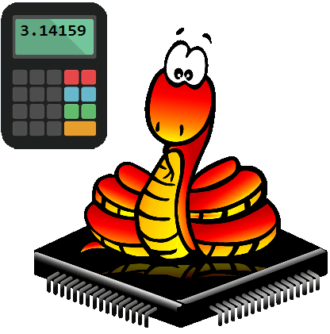

# micropython/circuitpython benchmarks

A simple performance comparison between microPython and CircuitPython, comparing the performance of different chips by calculating the time required for operations such as addition, multiplication, division, exponentiation, complex numbers, and pi (the smaller the value, the faster).

**Reference test results**

| Device                               |  AMD 4800U  | Intel 8250U | Intel  N5105 | MT6895Z(8100) | MSM8998(835) |   S905L3   |   rpi4b    |   rpi2b   |  imxrt1062  |   imxrt1062   | STM32H743ZI | STM32F746ZG |  STM2F746NG  |   esp32s3   |   esp32s3   |   esp32c6   |   esp32c3   |    esp32    |   esp32S2   |   esp32S2   |  STM32F405  |  STM32F411  |   STM32F411   |    RP2040     |   RP2040    |    SAMD51     |   SAMD51    |   SAMD21    |  nrf52833   |   nRF52833    |   esp8266   |
|--------------------------------------|:-----------:|:-----------:|:------------:|:-------------:|:------------:|:----------:|:----------:|:---------:|:-----------:|:-------------:|:-----------:|:-----------:|:------------:|:-----------:|:-----------:|:-----------:|:-----------:|:-----------:|:-----------:|:-----------:|:-----------:|:-----------:|:-------------:|:-------------:|:-----------:|:-------------:|:-----------:|:-----------:|:-----------:|:-------------:|:-----------:|
| Platform                             |    win32    |    win32    |    linux     |     linux     |    termux    |   linux    |   linux    |   linux   | MicroPython | CircuitPython | MicroPython | MicroPython | MicroPython  | MicroPython | MicroPython | MicroPython | MicroPython | MicroPython | MicroPython | MicroPython | MicroPython | MicroPython | CircuitPython | CircuitPython | MicroPython | CircuitPython | MicroPython | MicroPython | micropython | CircuitPython | MicroPython |
| Version                              |   3.11.2    |   3.12.7    |    3.12.5    |    3.12.7     |    3.11.5    |  3.10.12   |   3.11.2   |   3.9.2   |   v1.23.0   |     9.1.4     |   v1.23.0   |   v1.23.0   | v1.24.0.p408 |   v1.23.0   |   v1.23.0   | v1.24.0p407 |   v1.23.0   |   v1.23.0   |   v1.23.0   |   v1.23.0   |   v1.23.0   |    v1.23    |     9.1.4     |     9.1.4     |   v1.23.0   |     9.1.4     |   v1.23.0   |   v1.23.0   |   unknow    |     9.1.4     |   v1.23.0   |
| Frequency                            |    1800     |   1800.0    |    2900.0    |    unknow     |    1929.6    |    2016    |   1800.0   |    900    |     600     |      600      |     400     |     216     |     192      |     240     |     240     |     160     |     160     |     160     |     160     |     160     |     168     |     96      |      96       |      125      |     125     |      120      |     120     |     48      |     64      |      64       |     80      |
| Memory                               | 16557895680 | 8461197312  | 12307279872  |    unkonw     |  3913424896  | 1898082304 | 8188366848 | 966762496 |   768384    |    949760     |   460480    |   159808    |   8196480    |   244224    |   8321536   |   326144    |   203264    |   166592    |   137728    |   7797248   |    99328    |    83392    |     83136     |    179328     |   233024    |    150656     |   173120    |    21696    |    64512    |     54400     |    38016    |
| Integer addition 10000 times         |      0      |      0      |      1       |       2       |      2       |     8      |     1      |    15     |     11      |      14       |     18      |     33      |      37      |     34      |     34      |     48      |     49      |     61      |     59      |     59      |     56      |     91      |      116      |      97       |     80      |      84       |     71      |     269     |     182     |      221      |     214     |
| Integer addition 100000 times        |      0      |      0      |      7       |      15       |      21      |     73     |     12     |    149    |     109     |      144      |     178     |     325     |     378      |     338     |     338     |     481     |     485     |     611     |     589     |     589     |     564     |     904     |     1165      |      958      |     799     |      840      |     710     |    2687     |    1810     |     2210      |    2133     |
| Integer addition 1000000 times       |     46      |     78      |      78      |      149      |     157      |    727     |    121     |   1507    |    1092     |     1454      |    1783     |    3284     |     3773     |    3376     |    3376     |    4814     |    4851     |    6112     |    5887     |    5887     |    5638     |    9041     |     11647     |     9577      |    7984     |     8400      |    7095     |    26857    |    18098    |     22091     |    21335    |
| Integer multiplication 10000 times   |      0      |      0      |      1       |       1       |      2       |     7      |     1      |    18     |     37      |      46       |     58      |     152     |     153      |     110     |     119     |     141     |     142     |     193     |     181     |     193     |     206     |     348     |      327      |      288      |     276     |      274      |     219     |     921     |     582     |      613      |     611     |
| Integer multiplication 100000 times  |      0      |     15      |      8       |      15       |      17      |     75     |     13     |    183    |     381     |      453      |     586     |    1523     |     1522     |    1099     |    1190     |    1420     |    1425     |    1934     |    1814     |    1936     |    2077     |    3493     |     3275      |     2888      |    2823     |     2753      |    2223     |    9224     |    5829     |     6141      |    6114     |
| Integer multiplication 1000000 times |     47      |     94      |      79      |      150      |     177      |    746     |    124     |   1829    |    3808     |     4689      |    5868     |    15231    |    15576     |    11005    |    11924    |    14222    |    14260    |    19363    |    18161    |    19374    |    20788    |    34960    |     32806     |     28907     |    28283    |     27601     |    22236    |    92417    |    58341    |     61492     |    61255    |
| Integer division 10000 times         |      0      |      0      |      1       |       1       |      2       |     7      |     2      |    14     |     17      |      15       |     24      |     58      |      54      |     49      |     50      |     81      |     85      |     87      |     99      |     102     |     88      |     145     |      119      |      116      |     126     |      86       |     87      |     502     |     294     |      222      |     255     |
| Integer division 100000 times        |      0      |      0      |      8       |      16       |      19      |     70     |     13     |    142    |     174     |      150      |     246     |     581     |     534      |     488     |     510     |     813     |     863     |     866     |    1004     |    1035     |     889     |    1452     |     1189      |     1154      |    1321     |      857      |     909     |    5020     |    2933     |     2224      |    2553     |
| Integer division 1000000 times       |     63      |     78      |      79      |      159      |     176      |    699     |    128     |   1418    |    1739     |     1526      |    2464     |    5822     |     5423     |    4884     |    5114     |    8134     |    8636     |    8669     |    10049    |    10370    |    8896     |    14521    |     11886     |     11537     |    13221    |     8570      |    9113     |    50265    |    29342    |     22236     |    25520    |
| Float addition 10000 times           |      0      |      0      |      1       |       1       |      1       |     7      |     1      |    13     |     19      |      18       |     28      |     77      |      69      |     52      |     54      |     72      |     76      |     95      |     91      |     94      |     105     |     173     |      135      |      113      |     129     |      95       |     101     |     430     |     289     |      246      |     245     |
| Float addition 100000 times          |      0      |     16      |      8       |      14       |      16      |     67     |     11     |    132    |     194     |      176      |     283     |     766     |     689      |     526     |     549     |     732     |     768     |     946     |     923     |     953     |    1068     |    1741     |     1350      |     1126      |    1343     |      956      |    1048     |    4318     |    2892     |     2458      |    2444     |
| Float addition 1000000 times         |     47      |     47      |      70      |      135      |     140      |    675     |    106     |   1322    |    1940     |     1773      |    2838     |    7671     |     6931     |    5273     |    5505     |    7332     |    7693     |    9462     |    9239     |    9556     |    10693    |    17418    |     13502     |     11249     |    13447    |     9563      |    10511    |    43214    |    28950    |     24571     |    24439    |
| Float multiplication 10000 times     |      0      |      0      |      1       |       2       |      1       |     7      |     1      |    13     |     19      |      18       |     28      |     77      |      69      |     52      |     54      |     71      |     77      |     94      |     91      |     93      |     106     |     175     |      136      |      113      |     129     |      96       |     102     |     438     |     281     |      246      |     249     |
| Float multiplication 100000 times    |      0      |     15      |      7       |      13       |      14      |     67     |     11     |    131    |     195     |      180      |     285     |     769     |     690      |     523     |     546     |     722     |     779     |     937     |     920     |     951     |    1073     |    1751     |     1354      |     1132      |    1343     |      958      |    1056     |    4405     |    2811     |     2449      |    2487     |
| Float multiplication 1000000 times   |     47      |     47      |      70      |      134      |     140      |    674     |    107     |   1314    |    1949     |     1798      |    2854     |    7693     |     6951     |    5231     |    5465     |    7232     |    7786     |    9392     |    9196     |    9517     |    10739    |    17527    |     13542     |     11321     |    13440    |     9578      |    10540    |    44132    |    28133    |     24495     |    24869    |
| Float division 10000 times           |      0      |      0      |      1       |       1       |      2       |     7      |     1      |    13     |     20      |      18       |     29      |     75      |      70      |     55      |     56      |     80      |     85      |     98      |     107     |     110     |     106     |     175     |      137      |      119      |     134     |      97       |     103     |     510     |     319     |      249      |     275     |
| Float division 100000 times          |      0      |      0      |      7       |      15       |      16      |     69     |     12     |    134    |     201     |      180      |     294     |     749     |     699      |     551     |     574     |     816     |     853     |     981     |    1090     |    1123     |    1079     |    1755     |     1372      |     1187      |    1399     |      971      |    1067     |    5134     |    3202     |     2488      |    2743     |
| Float division 1000000 times         |     47      |     63      |      77      |      148      |     177      |    684     |    131     |   1340    |    2013     |     1813      |    2938     |    7495     |     7036     |    5508     |    5745     |    8173     |    8538     |    9816     |    10908    |    11238    |    10795    |    17571    |     13720     |     11866     |    14002    |     9712      |    10696    |    51418    |    32019    |     24869     |    27425    |
| Power calculation 10000 times        |      0      |      0      |      2       |       2       |      4       |     8      |     2      |    19     |     31      |      25       |     54      |     112     |     114      |     80      |     82      |     442     |     739     |     138     |     864     |     827     |     143     |     241     |      191      |      290      |     993     |      152      |     165     |    3567     |     418     |      337      |    1155     |
| Power calculation 100000 times       |     16      |     16      |      13      |      21       |      35      |     84     |     20     |    188    |     314     |      256      |     541     |    1113     |     1141     |     801     |     825     |    4422     |    7402     |    1391     |    8192     |    8749     |    1436     |    2416     |     1907      |     2892      |    9988     |     1564      |    1690     |    35679    |    4190     |     3375      |    11543    |
| Power calculation 1000000 times      |     140     |     188     |     120      |      208      |     344      |    841     |    193     |   1865    |    3138     |     2567      |    5437     |    11129    |    11467     |    8013     |    8254     |    44228    |    74027    |    13918    |    86523    |    87498    |    14372    |    24176    |     19064     |     28914     |    99891    |     15653     |    16945    |   357190    |    41907    |     33754     |   115434    |
| Mandelbrot iterating 100 times       |     16      |     15      |      17      |      31       |      37      |    125     |     33     |    264    |     701     |      574      |     734     |    1814     |     2021     |    1565     |    1731     |    2711     |    3148     |    2977     |    6258     |    6682     |    2891     |    4791     |     4335      |     4905      |    5212     |     4015      |    None     |    None     |    11032    |     None      |    None     |
| Mandelbrot iterating 500 times       |     62      |     94      |      69      |      130      |     149      |    506     |    121     |   1065    |    2597     |     1901      |    2718     |    6765     |     7582     |    5448     |    5863     |    9675     |    11291    |    9931     |    20219    |    22738    |    10075    |    16427    |     13321     |     15548     |    18820    |     11704     |    None     |    None     |    34175    |     None      |    None     |
| Mandelbrot iterating 5000 times      |     672     |     828     |     662      |     1304      |     1436     |    4868    |    1154    |   10341   |    23609    |     16591     |    24905    |    62205    |    69766     |    49099    |    51984    |    87640    |   102477    |    88060    |   197838    |   202121    |    90640    |   147001    |    114136     |    134776     |   171320    |     98082     |    None     |    None     |   293353    |     None      |    None     |
| Pi Calculation 1000 bits             |      0      |      0      |      1       |       3       |      4       |     8      |     3      |    59     |     73      |      77       |     100     |     287     |     203      |     389     |     415     |     526     |     537     |     660     |     838     |     958     |     650     |    1156     |      845      |      878      |     868     |      787      |     710     |    3999     |    1977     |     1888      |    1868     |
| Pi Calculation 5000 bits             |     31      |     31      |      35      |      44       |      45      |    112     |     47     |   1317    |    3591     |     1397      |    3979     |    5490     |     5217     |    6526     |    7456     |    8697     |    9167     |    11983    |    12530    |    15703    |    11485    |    18073    |     15244     |     16148     |    23338    |     14479     |    16783    |    None     |    37419    |     36192     |    41057    |
| Pi Calculation 10000 bits            |     110     |     140     |     150      |      213      |     238      |    520     |    216     |   5150    |    10906    |     6345      |    12399    |    18080    |    29793     |    23642    |    27833    |    32611    |    33959    |    41551    |    44133    |    59585    |    40790    |    67550    |     68559     |     66666     |    70450    |     60382     |    53817    |    None     |    None     |     None      |    None     |
| Pi Calculation 100000 bits           |    14218    |    22703    |    23149     |     39184     |    47170     |   86021    |   36806    |  540741   |   707552    |    578172     |    None     |    None     |   3968801    |    None     |   3456572   |    None     |    None     |    None     |    None     |   7553302   |    None     |    None     |     None      |     None      |    None     |     None      |    None     |    None     |    None     |     None      |    None     |
| Pi Calculation 200000 bits           |    59453    |    93469    |    97739     |    190532     |    223263    |   368220   |   156457   |  2221524  |    None     |    2395052    |    None     |    None     |   12179439   |    None     |  14922482   |    None     |    None     |    None     |    None     |  29965747   |    None     |    None     |     None      |     None      |    None     |     None      |    None     |    None     |    None     |     None      |    None     |

- The time unit is milliseconds.
- The above list is not sorted by performance.
- The above results are for reference only.

[From microbit/micropython Chinese community.](http://www.micropython.org.cn)  
